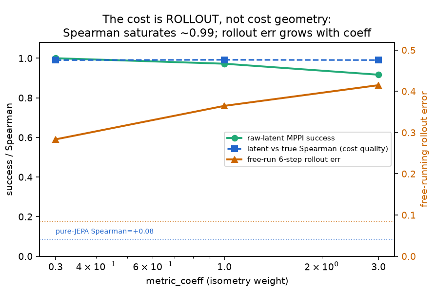

<h1 align="center">Microbiome-JEPA</h1>

<p align="center">
  <b>An Energy-Based JEPA <i>world model of microbial communities under intervention</i>.</b><br>
  Predict how a community's latent state changes <i>under an action</i> — never reconstruct abundances.
</p>

<p align="center">
  <code>(community, dose) → next community</code> &nbsp;·&nbsp; plan interventions by descent on a learned latent
</p>

<p align="center">
  Built on <a href="https://github.com/marinabar/eb_jepa">eb-JEPA</a> &nbsp;·&nbsp;
  📄 <a href="paper/main.pdf"><b>read the paper</b></a> &nbsp;·&nbsp;
  📒 <a href="docs/WORK_REPORT.md">full quantitative log</a>
</p>

<p align="center">
  
  <br>
  <sub><i>Once the latent is given a metric (isometry auxiliary), raw-latent MPPI planning
  succeeds and the latent-vs-true rank correlation saturates at <b>~0.99</b> (vs. +0.08 for pure
  JEPA). Raising the metric weight trades a little forecasting accuracy (rollout error grows) for
  metric quality — <code>metric_coeff=0.3</code> is the sweet spot.</i></sub>
</p>

---

## TL;DR

We learn a **world model** that predicts how a microbial community's state changes **under an
intervention** (a dose on a candidate-species panel), entirely in latent space (JEPA — no count
reconstruction):

$$\mathcal{E} \;=\; \lVert\, g_\phi(f_\theta(x),\, q_\omega(a)) - f_\theta(x') \,\rVert^2 \;+\; \lambda\, R(z)$$

- $f_\theta$ permutation-invariant set encoder · $g_\phi$ action-conditioned predictor ·
  $q_\omega$ action encoder · $R$ anti-collapse regularizer.
- $x$ = community now, $a$ = intervention, $x'$ = community next.

**The central question:** is a predictive latent good enough to *plan* on? The honest answer here is
**not by default** — a faithful predictor can carry a useless planning metric — but it can be **made**
to, with one explicit auxiliary.

> **Integrity (non-negotiable):** no invented numbers. Every result is a run we actually ran;
> negative and surprising results are reported as-is. See [`docs/WORK_REPORT.md`](docs/WORK_REPORT.md).

---

## Headline results (all measured)

| # | Question | Result | Verdict |
|---|---|---|---|
| **IDM** | Does inverse-dynamics rescue the *action* signal a JEPA tends to collapse away? | intervention-decodability $R^2$ **0.520 → 0.748** (+0.229, all 3 seeds); regime-dependent | ✅ positive |
| **Forecast** | Short-horizon prediction vs. ecology baselines (MDSINE2-style HOSO) | JEPA is the **best curve at every horizon** ($h=1/3/5/10$) | ✅ positive |
| **Probe** | Frozen embedding on a real infant-gut task vs. a published baseline | SIGReg-$d384$ MLP **0.531 / 0.899** (beats baseline on both axes) | ✅ positive |
| **Planning** | Can we plan interventions with the pure-JEPA latent? | **0%** across 8 independent levers — the latent is faithful but **not a metric** | ❌ diagnosed negative |
| **Closure** | Supply the missing geometry (isometry auxiliary) | planning **0% → 100%**, final **0.804 ≈ oracle 0.790**; generalizes 4/4 instances | ✅ positive (hybrid) |
| **Tech-inv.** | Remove sequencing-technology nuisance | DANN **fails**; CORAL gives a **partial, linear-only** fix | ❌/◐ |
| **Tahoe** | Does the recipe transfer to real drug perturbations? | predictor beats per-drug baseline ($R^2$ 0.201 vs 0.149); IDM **hurts** on a frozen encoder | ◐ mixed |

The decisive lesson: **faithful one-step prediction does not imply a plannable metric** — and the
metric must be *supplied*, not hoped for.

---

## Repository layout

```
eb_jepa/                         the upstream eb-JEPA framework (encoder/predictor/regularizers/unroll)
  architectures.py               + SetTransformerEncoder, TechAdversaryHead (GRL)        [contribution]
  losses.py                      + SIGReg_IDM_Sim_Regularizer, ImposterRepulsionLoss     [contribution]
  datasets/microbiome/           gLV "Two-Rooms" simulator, set/traj datasets, transforms [contribution]

examples/microbiome_jepa/        the world-model contribution
  main.py                        Layer A: static community set-JEPA (VICReg/SIGReg, EMA, DANN/CORAL)
  train_worldmodel.py            Layer B: action-conditioned world model (+ IDM, + metric auxiliary)
  eval_collapse.py               IDM collapse-and-recovery ablation (M4)
  plan_glv*.py / diagnose_planning.py   MPPI planning + layered diagnosis (M3)
  realdata.py / probe_downstream.py     real infant-gut downstream probe (M2)
  tech_invariance.py / tech_sweep.py    sequencing-technology invariance (DANN / CORAL / MMD)
  results/                       all measured JSON + figures
examples/microbiome_benchmark/   MDSINE2-style hold-one-subject-out temporal benchmark
examples/tahoe_probe/            real-world generality check on Tahoe-100M drug perturbations

paper/main.tex,  paper/main.pdf  the academic write-up        docs/WORK_REPORT.md  exhaustive log
```

---

## Quickstart (CPU, no downloads)

The synthetic gLV experiments need no data. With a CPU PyTorch environment:

```bash
# contract smoke tests (encoder shape/permutation-invariance, gLV simulator, data pipeline)
python -m examples.microbiome_jepa._smoke_plan
python eb_jepa/datasets/microbiome/_smoke_glv.py

# Layer A — static community set-JEPA (2-epoch synthetic smoke)
python -m examples.microbiome_jepa.main \
    --fname examples/microbiome_jepa/cfgs/layerA_vicreg.yaml \
    --optim.epochs 2 --data.size 256 --data.batch_size 32

# IDM collapse-and-recovery ablation (the M4 headline)
python -m examples.microbiome_jepa.run_ablation        # see script header for sweep flags
```

GPU runs (world-model training, planning sweeps, benchmark) used a GB200 SLURM cluster; the
`run_*.sh` / `*.slurm` scripts in each example folder document the exact commands and job settings.

---

## Build the paper

```bash
make paper            # compiles paper/main.tex -> paper/main.pdf  (needs a LaTeX engine)
```

If no LaTeX engine is installed, `make paper` prints install hints (`tectonic`, or
`texlive`); the figures it uses are committed under `paper/figures/`.

---

## Provenance

This repository is a fork of the [eb-JEPA](https://github.com/marinabar/eb_jepa) framework; the
encoder/predictor/regularizer/`unroll` machinery is **upstream** and credited under
[`LICENSE.md`](LICENSE.md). Everything in `examples/microbiome_jepa/`,
`examples/microbiome_benchmark/`, `examples/tahoe_probe/`, the microbiome additions to `eb_jepa/`,
and `paper/` is the author's contribution.
